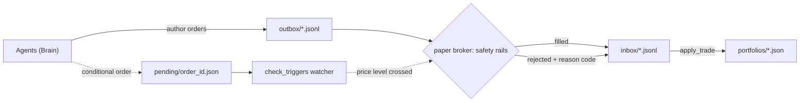

# midas-core

**An open, multi-agent paper-trading fund-manager framework built on a Brain/Hands split:
agents author decisions; a broker enforces the safety rails and executes them.** This repo
is the reusable core — the engine, the config-driven roster/allocator model, a runnable demo
desk, and the deterministic Hands pipeline. Bring your own agents.

[](https://github.com/w2ur/midas-core/actions/workflows/tests.yml)
[](./LICENSE)
[](https://www.python.org/downloads/)

> **Paper-trading by default.** This is a framework, not a service: it never executes against
> your broker keys, never pools funds, never gives per-user advice. See [DISCLAIMER.md](./DISCLAIMER.md).

## Why this exists

- **Safety lives in the broker, not the prompt.** The persona is aspirational; the broker is
  enforcing. Every order is checked at fill time against a fixed set of 14 rejection/cancel
  reason codes — `MAX_ORDER_NOTIONAL`, `MAX_ORDERS_PER_DAY`, `TICKER_NOT_IN_UNIVERSE`,
  `INSUFFICIENT_CASH`, `DAILY_DRAWDOWN_HALT`, … — so a coaxed or confused agent still can't
  slip an oversized or out-of-universe trade through.
- **Reproducible by construction.** Dependencies are a fully-pinned lockfile; prices and index
  universes are committed to git; a trading session makes no outbound HTTP calls. Every fill is
  stamped with `executed_sha`, the git HEAD it executed against — `git checkout <sha>` re-derives
  the exact order and price store the broker saw.
- **Proven on a live desk.** A 10-agent desk has run this engine every weekday since 2026-04-17,
  narrated publicly at [midas.revah.paris](https://midas.revah.paris). This repo is a one-way
  code mirror of that desk's engine — the same code, without the private data ledger.
- **Conditional orders, not just market orders.** Agents can defer a trade until a price level
  is crossed. Expiry is mandatory; a separate watcher process fires the order when the condition
  is met and applies the same order-level rails as a market fill.

## Architecture — Brain / Hands

The **Brain** (agents) only ever writes to disk; it holds no credentials. The **Hands** (the
paper broker, a separate watcher process) reads that outbox, enforces the rails, and executes.
The boundary is a directory of append-only JSONL files, so a real-money broker is a drop-in swap
for the paper one behind the same contract.



## Quickstart — reach a real fill

This drives the full loop end-to-end: bootstrap prices, hand-author two orders (one clears, one
is deliberately oversized to trip a rail), run the broker, and inspect the fills.

```bash
python -m venv .venv && source .venv/bin/activate
pip install -r requirements.txt   # pinned lockfile (incl. pytest + hypothesis)
pip install -e .                  # the midas-core package + the `midas` CLI

# Point the engine at a working copy of the demo desk.
cp -R examples/demo-desk /tmp/my-desk
export MIDAS_DATA_DIR=/tmp/my-desk

# One-time: open a USD 10,000 portfolio for demo-momentum.
python -c "
from engine.config import get_config
from engine.portfolio import PortfolioManager
pm = PortfolioManager(base_dir=get_config().portfolios_dir)
pm.initialize('demo-momentum', initial_capital=10000, currency='USD')
"

# Bootstrap the price store from yfinance (the one networked step; the live desk
# populates this store from a cron so trading sessions stay HTTP-free).
midas fetch-ohlcv --symbols SPY,QQQ,IWM,VTV,SCHD,BRK-B,URTH --history-days 90
```

Author two orders — append-only JSONL, one per line — to
`$MIDAS_DATA_DIR/data/orders/outbox/<TODAY>.jsonl` (`<TODAY>` = today's `YYYY-MM-DD`). Every
field is required, including a non-empty `reasoning` (no silent trades); `shares` must be
strictly positive (Midas is long-only):

```jsonl
{"order_id": "ord_demo_001", "ts": "2026-04-17T20:00:00Z", "agent_id": "demo-momentum", "action": "BUY", "ticker": "SPY", "shares": 3, "reasoning": "Trend intact above the 50-day; adding core exposure.", "currency": "USD"}
{"order_id": "ord_demo_002", "ts": "2026-04-17T20:00:00Z", "agent_id": "demo-momentum", "action": "BUY", "ticker": "SPY", "shares": 10, "reasoning": "Deliberately oversized clip to demonstrate the notional rail.", "currency": "USD"}
```

`demo-momentum`'s `max_order_notional` is `5000`. With SPY near $740 the first order (~$2,200)
clears; the second (~$7,400) breaches the cap. Run the broker:

```bash
midas fill-day
# fill-day: 1 filled, 1 rejected out of 2
```

The inbox is the durable Hands-side record of both outcomes:

```bash
cat $MIDAS_DATA_DIR/data/orders/inbox/<TODAY>.jsonl
```

```jsonl
{"order_id": "ord_demo_001", "status": "filled",   "fill_price": 738.18, "notional_base": 2214.54, "fees": 1.25, "reason": null}
{"order_id": "ord_demo_002", "status": "rejected",  "fill_price": null,   "notional_base": null,    "fees": null, "reason": "MAX_ORDER_NOTIONAL"}
```

The filled order mutated `data/portfolios/demo-momentum/portfolio.json` (cash debited, a SPY
position opened); the rejected one changed nothing but its reason. Exact prices depend on the day
you fetch — the shape (one fill, one rejection, a debited portfolio) is the point.

Run the test suite:

```bash
pytest -q
```

The full walkthrough — the portfolio JSON, the `executed_sha` provenance stamp, and the roster
schema — is in [`./examples/demo-desk/README.md`](./examples/demo-desk/README.md).

## Run your own desk

The whole cast is config. Copy the demo desk and edit two things:

1. **`roster.yaml`** — declare your traders, a `narrator`, and an optional `allocator`, each with
   its universe, starting capital, and **broker-enforced** `safety` rails (`max_order_notional`,
   `max_orders_per_day`, `daily_drawdown_halt_pct`, `allowed_universe`).
2. **`.claude/agents/*.md`** — the persona behind each id: its voice and its strategy.

Nothing else is hardcoded. The full roster schema (every field and its default) is documented in
[`./examples/demo-desk/README.md`](./examples/demo-desk/README.md).

## What you need

| To run…                                                        | Requirements                                   |
| -------------------------------------------------------------- | ---------------------------------------------- |
| **Deterministic pipeline** — fills, baselines, backtests       | Python 3.12+ only. No API keys, no accounts.   |
| **LLM trading sessions** — personas, journals, narration       | Runs under [Claude Code](https://claude.com/claude-code) (`scripts/daily_session.py`). |

The deterministic pipeline is headless and fully tested; you can drive a desk end-to-end with no
model at all by hand-authoring orders, exactly as the quickstart does.

## Honest framing

- **Paper-trading by default.** Fills are simulated against a committed price store. No output is
  a track record, evidence of an edge, or investment advice.
- **Framework, not a service.** midas-core never executes against your broker keys, never holds
  credentials, never pools or manages anyone's funds, and gives no per-user advice. A real-money
  broker would be *your* code, swapped in behind the same outbox/inbox contract.
- Full terms: [DISCLAIMER.md](./DISCLAIMER.md).

## Relationship to the live desk

This repository is a **one-way code mirror**, synced from the operator's private live repo (the
source of truth) by a manifest tool. The live desk's data ledger — its real portfolios, journals,
and daily narrative — stays private and is **not** in this repo; the bundled `examples/demo-desk`
is a synthetic fixture. Because of the mirror direction, code PRs against synced trees can't be
merged — please open an issue instead. See [CONTRIBUTING.md](./CONTRIBUTING.md).

## Layout

- `engine/` — types, market data, bt adapter, paper broker, config (`roster.yaml` loader), universes.
- `scripts/` — session orchestration (`daily_session.py`), the conditional-order watcher
  (`check_triggers.py`), backtest runners, universe refresh.
- `examples/demo-desk/` — the forkable reference desk.
- `data/{strategies,universes}/` — generic strategy specs + index constituents.

## License

[MIT](./LICENSE).
